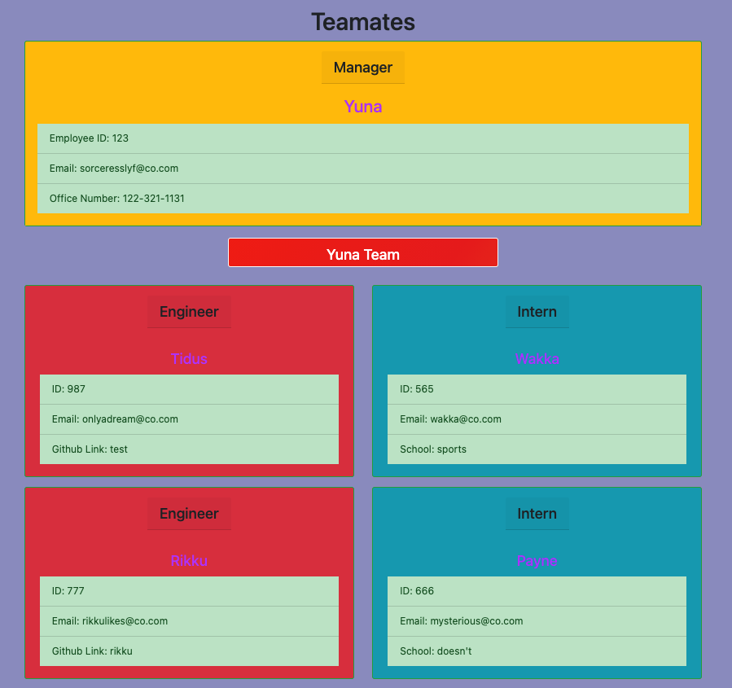

# **Team Contact Page!**

  
  

## Table of contents
  -[Description](#Description)
  -[Installation](#Installation)
  -[Usage](#Usage)
  -[Example](#Example)

  -[License](#License)
  -[Contribution](#Contribution)
  -[Test](#Testing)
  -[Repository](#Repository)

  -[Questions & Contact Information](#Questions)

## Description

  -  Need a handy tool to construct professional quality Team Contact's Page? Eureka!! This app will guide you step by step and you'll love the results!

## Installation
#### **- Run**
          $ npm i inquirer
    
## Usage
#### **- Run**
          $ node index.js
**- Follow each prompt for the Manager, then select wheather you need an Intern or Engineer. When satisfied simply select generate page.**

## Example 

### **- Outcome product...**

### **- Check out my walkthrough video**

**[vids](https://drive.google.com/file/d/1gTryomKm9NhxWHo9kH_oUFR7zLN2GA7C/view?usp=sharing)**

## License

  **- The app was made under the 
  [ISC](https://opensource.org/licenses/ISC)
   license.**

## Contribution

  **- Github User 
  [Badjuju666](https://github.com/Badjuju666)**

## Testing 
  
  **-  Run as instructed then check project folder for new Team Contact Page under index.html.**

## Repository

  **- [My Repo](https://github.com/Badjuju666/Team-Contact-Page-Gen).**

## Questions
  **- Address any questions or concerns 
  to the contacts below...**
                

- Julian Graves
- Github Profile](https://github.com/Badjuju666)
- <juliangraves96@gmail.com>